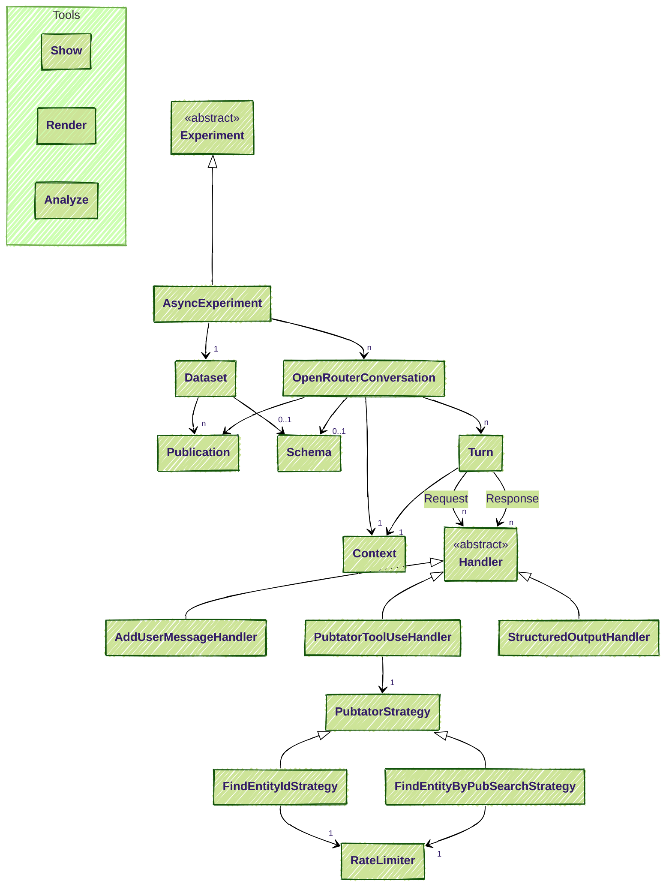
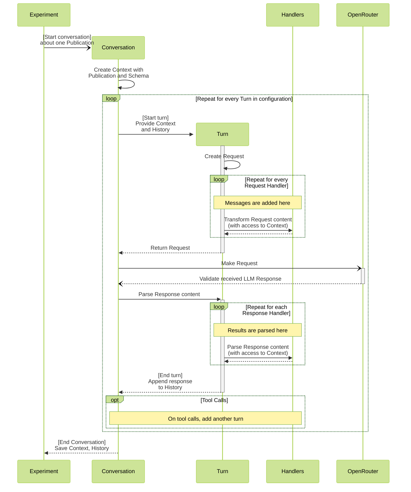

# Automated Contextual Metadata Annotation with Grounded LLMs

This repository provides a framework for performing experiments with Large Language Models (LLMs) to annotate publications with metadata. It is designed to work with OpenRouter and supports the use of tools like PubTator for entity recognition. The framework allows for structured output handling to prepare for a fully automated metadata annotation process. It is particularly useful for annotating scientific publications with contextual metadata, such as entities and relationships, based on their content. The framework is built using Python, utilizing the uv package for task management.

## 1. Setup

1. Install [uv](https://docs.astral.sh/uv/getting-started/installation/).
2. Clone this repository.
3. Copy `default.env` to `.env` and set the variables. See [Application Configuration](#application-configuration).

### 1.1 Application Configuration

The `.env` file will contain secrets (like API keys) that should not be shared
and is thus not part of the repository. For performing OpenRouter experiments,
you need to enter your API key there.

### 1.2 Experiment Configuration

You can find the settings for single experiments in the `configs` folder. The
settings are described in the corresponding `Config` classes in the code or in
the example configurations.

## 2. Publication Replication

If you are only interested in replicating the experiments from the publication, you can use
configuration files from the `configs/nephgen-nine` folder after the setup. Each configuration
uses a specific model to annotate the publications in the `datasets/nephgen-nine` folder. 

Example:

```sh
uv run experiment configs/nephgen-nine/gemini25flashpreview.yml
```

The results will be written in a new folder with a timestamp in `experiments`. You can use the
[Show tool](#4-show) to inspect the conversations and statistics. The following command without an `index` will list a table of conversations in the experiment, or, with an `index`, the corresponding conversation:

```sh
uv run show -e experiments/[timestamp]-n9-gemini25flashpreview.yml conversation [index]
```

Viewing the statistics works the same by replacing `conversation` with `evaluate`.

The raw of all our experiments for the publication are stored in `saved_experiments/nephgen-nine` and
the [rendered](#5-render) conversations, statistics and plots can be found in `rendered_experiments/nephgen-nine`.

## 3. Datasets

### 3.1 Create dataset from fredato metadata

A dataset can be created from a fredato GitLab repository that contains metadata
files with this command:

`uv run dataset create <metadata_directory> <output_directory>`

As an example, this command:

`uv run dataset create metadata/1453-publications datasets/1453-datasets`

will create a folder in `datasets/1453-datasets` for each metadata file found
in `metadata/1453-publications` with the UUID as name. To perform the experiments,
each of these folders will need the publication as a PDF with the name `paper.pdf`.
Additionally, a supplement can be deposited under the name `supplement.pdf`. 
Downloading the PDFs is not automated, but the command above will display the DOI
for each publication to help find the PDF.

Rerunning the command on an existing dataset will not overwrite it, so it can be
used to display the DOIs at a later point in time.

### 3.2 PDF Conversion

The publication will be provided to the LLM in the text message. The PDFs therefore
have to converted to a text-based format. We use [Docling](https://docling-project.github.io/docling/)
for this. It depends on Pytorch and other large packages, so installing Docling is
optional:

`uv sync --extra docling`

All publications in a dataset, that have a `paper.pdf`, can be converted by running:

```sh
uv run dataset convert <dataset_directory>
```

The results will be stored in `paper.md` (for the LLM) and `paper.html` (for easy viewing).

Note that we install the CPU-only variant of Pytorch. If you want GPU acceleration for large
datasets, you can add the corresponding index and change the source in `pyproject.toml`.

## 4. Run an experiment

Execute `uv run experiment <config_path>` in a terminal with the path to a configuration file.
Configurations are should be stored as `.yml` files in the `configs` folder.

Every run will create a folder in `experiments`. The name of the folder is a
combination of the timestamp and a name defined in its config file. This folder
will contain all results and a copy of the config file.

## 5. Show

The show tool is a command-line utility for browsing and inspecting conversation logs saved from your experiments. It provides commands to list conversations and display specific messages from an experiment. It can be called with `uv run show` and supports the following commands:

- `conversation` (aliases: `conv`, `c`):

    Displays conversations from an experiment. A conversation ID can either be the UUID
    of the publication or the index for the conversation in the result. If no conversation ID is provided, a list of conversation UUIDs and indices is displayed.

    Usage:
    `uv run show conversation [conversation_id]`

- `prompt` (alias: `p`):

    Shows a user prompt message from a conversation.

    Usage:
    `uv run show prompt <conversation_id> <prompt_index>`

- `answer` (alias: `a`):

    Displays an assistant answer message from a conversation.
    
    Usage:
    `uv run show answer <conversation_id> <answer_index>`

Additionally, the following parameters can be passed:

- `-e, --experiment_folder <experiment_folder>`:

    Determines the experiment folders from which the conversations are taken.
    If this it not provided, the `show` tool will select the latest experiment
    in the `experiments` folder.

- `-h, --help`:

    Displays the help message

## 6. Render

The render tool is a command-line utility for rendering experiment results and statistics into PDFs and PNGs. 
It can:
- Render all conversations and their evaluations from all experiments into PDFs.
- Generate summary statistics and plots (as PNGs) for inter-experiment comparisons.

If Chrome/Chromium is not found, only HTML files will be generated. To create plots, you need to have the plotting libraries installed. You can install them with:

```sh
uv sync --group render
```

Run the render tool with:

```sh
uv run render --input <experiments_folder> --output <output_folder> [options]
```

**Options:**

- `--input, -i <experiments_folder>`: Path to the folder containing experiment results (required).
- `--output, -o <output_folder>`: Path to the folder where rendered files will be saved (required).
- `--overwrite, -f`: Overwrite existing HTML/PDF files.
- `--no-plots`: Skip generating summary plots across all experiments.
- `--plots-only`: Only generate plots, skip rendering individual experiments.


Example:

```sh
uv run render --input experiments --output rendered --overwrite
```

This will render all conversations, evaluations and plots from the `experiments` folder into the `rendered` folder, overwriting any existing files.


**Note:**
The PubTator evaluation plot was configured to work with the experimental results for the publication. It might not work with other datasets or experiments.

## 7. Architecture

This is a rough overview of the classes. For more details, please check the docstrings of the classes.




The following diagram describes the flow for one conversation. This happens for each conversation concurrently.



## 8. Development

Before committing, please run the formatter and type checker:

```sh
uv run ruff format
```

```sh
uv run mypy
```